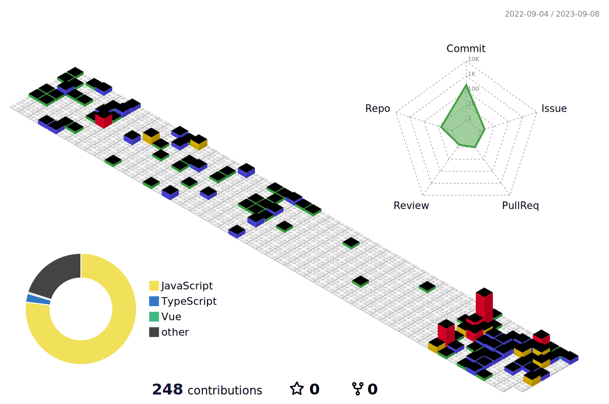

<div align="center">
  <a href="https://blog.csdn.net/Kris__zhang">
    
  </a>
</div>

## Hi, 👋 I'm Wade

- 🌱 目前正在学习 `Python` 、 `go` 和 `php`
- 📫 联系方式: lemonlove7@qq.com

### Languaues and Tools

<span > 
   
   
   
   
   
   
   
   
   
    
</span>

### My GitHub Contributions


### My GitHub Stats

<div align="left">
   
  
</div>

### My Activities

<!--START_SECTION:waka-->

```txt
From: 07 September 2022 - To: 07 September 2023

Total Time: 181 hrs 47 mins

Vue.js       85 hrs 39 mins  ███████████▓░░░░░░░░░░░░░   47.12 %
TypeScript   67 hrs 30 mins  █████████▒░░░░░░░░░░░░░░░   37.13 %
JavaScript   12 hrs 54 mins  █▓░░░░░░░░░░░░░░░░░░░░░░░   07.10 %
JSON         5 hrs 32 mins   ▓░░░░░░░░░░░░░░░░░░░░░░░░   03.05 %
Markdown     5 hrs 15 mins   ▓░░░░░░░░░░░░░░░░░░░░░░░░   02.89 %
Other        2 hrs 39 mins   ▒░░░░░░░░░░░░░░░░░░░░░░░░   01.46 %
```

<!--END_SECTION:waka-->

### My GitHub Contributions


